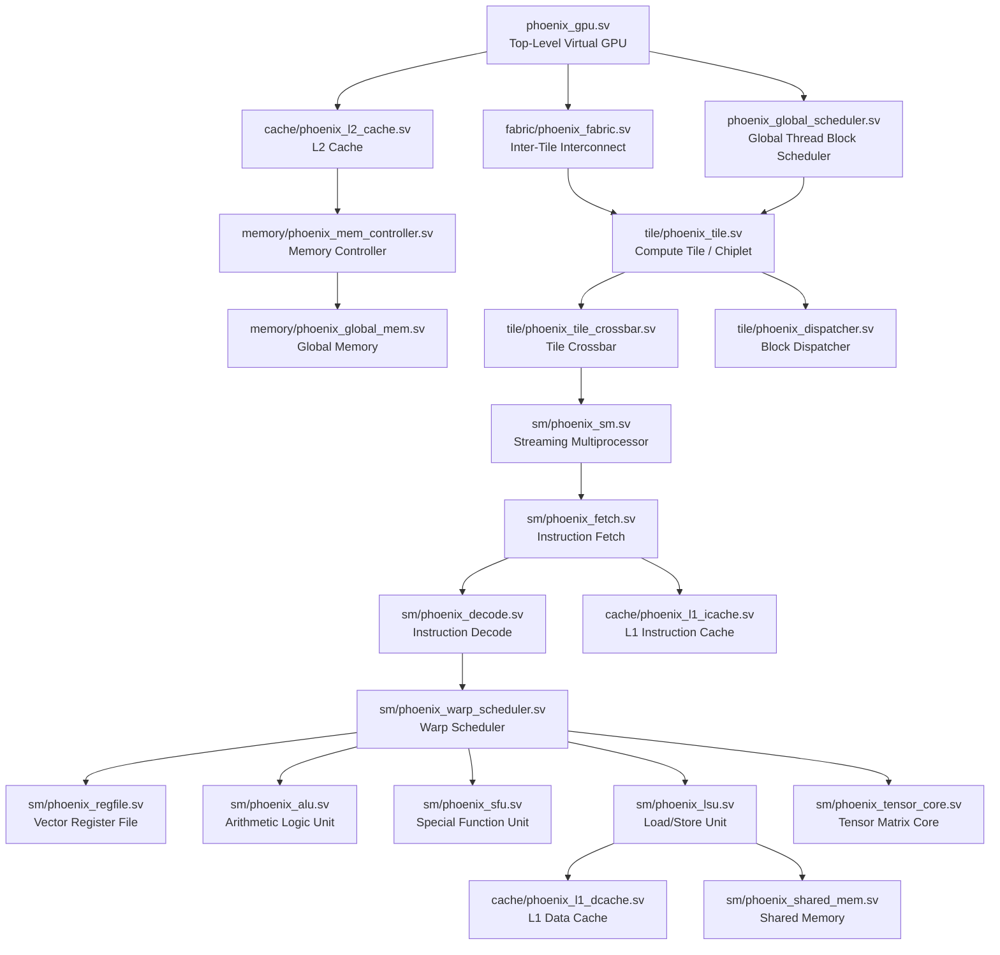

# Phoenix-XM

Phoenix-XM is an open-source educational and experimental GPU architecture built entirely in SystemVerilog. (shortly: GPU from scratch !)

It is designed to be a modular, configurable, and thoroughly documented foundation for exploring modern GPU concepts, focusing on learning and research rather than competing directly with commercial accelerators.

## Goals

* **Learn GPU architecture from first principles**
* **Build a modern pipelined GPU**
* **Implement warp scheduling and latency hiding**
* **Implement tensor acceleration**
* **Scale to a Virtual Monolithic GPU via chiplets**
* **Explore future optical interconnects**

## Status

**v0.1**
- Single SM implementation (Pipeline, RV32IM Decoder, Basic ALU, Register File, Tensor Core, LSU).
- Cocotb Verification Framework Integration.
- Basic Kernel Testing infrastructure.

## Repository Structure

```text
.
├── docs
│   ├── 01_vision.md
│   ├── 02_architecture.md
│   ├── 03_microarchitecture.md
│   ├── 04_pipeline.md
│   ├── 05_memory.md
│   ├── 06_scheduler.md
│   ├── 07_tensor_core.md
│   ├── 08_interconnect.md
│   ├── 09_runtime.md
│   ├── 10_isa.md
│   ├── 11_performance_model.md
│   └── 12_implementation_plan.md
├── LICENSE
├── Makefile
├── README.md
├── ROADMAP.md
├── rtl
│   ├── cache
│   │   ├── phoenix_l1_dcache.sv
│   │   ├── phoenix_l1_icache.sv
│   │   └── phoenix_l2_cache.sv
│   ├── fabric
│   │   ├── phoenix_fabric_router.sv
│   │   └── phoenix_fabric.sv
│   ├── memory
│   │   ├── phoenix_global_mem.sv
│   │   └── phoenix_mem_controller.sv
│   ├── phoenix_global_scheduler.sv
│   ├── phoenix_gpu.sv
│   ├── pkg
│   │   └── phoenix_pkg.sv
│   ├── sm
│   │   ├── phoenix_alu.sv
│   │   ├── phoenix_decode.sv
│   │   ├── phoenix_fetch.sv
│   │   ├── phoenix_lsu.sv
│   │   ├── phoenix_regfile.sv
│   │   ├── phoenix_sfu.sv
│   │   ├── phoenix_shared_mem.sv
│   │   ├── phoenix_sm.sv
│   │   ├── phoenix_tensor_core.sv
│   │   └── phoenix_warp_scheduler.sv
│   └── tile
│       ├── phoenix_dispatcher.sv
│       ├── phoenix_tile_crossbar.sv
│       └── phoenix_tile.sv
├── run_tests.sh
├── sw
│   ├── assembler
│   │   └── phoenix_asm.py
│   └── runtime
│       └── phoenix_runtime.py
└── test
    ├── golden
    │   └── gpu_model.py
    ├── helpers
    │   └── tb_dump.sv
    ├── kernels
    │   ├── test_divergence.py
    │   ├── test_matmul.py
    │   ├── test_prefix_sum.py
    │   ├── test_reduction.py
    │   └── test_vecadd.py
    └── unit
        ├── test_alu.py
        ├── test_decode.py
        ├── test_isa_control.py
        ├── test_isa_memory.py
        ├── test_lsu.py
        ├── test_pipeline_hazards.py
        ├── test_stress.py
        ├── test_tensor_core.py
        └── test_warp_scheduler.py
```

## System Architecture Overview

The Phoenix-XM architecture is organized in a hierarchical manner.



### Module Descriptions

#### Top Level
- `phoenix_gpu.sv`: The top-level wrapper that instantiates the entire GPU, connecting the fabric, global scheduler, and memory controllers.
- `phoenix_global_scheduler.sv`: Responsible for receiving kernels from the runtime and dispatching thread blocks to available tiles.

#### Tile (Chiplet) Level
- `phoenix_tile.sv`: Represents a physical die/chiplet containing multiple SMs, a local crossbar, and connection to the global fabric.
- `phoenix_tile_crossbar.sv`: Routes memory traffic and synchronization messages between SMs in the tile and the external fabric.
- `phoenix_dispatcher.sv`: Distributes thread blocks assigned to the tile down to individual Streaming Multiprocessors.

#### Streaming Multiprocessor (SM) Level
- `phoenix_sm.sv`: The core compute unit of the GPU. Orchestrates all pipelines, execution units, and the L1 caches.
- `phoenix_warp_scheduler.sv`: Maintains the state of all active warps and issues ready instructions from active warps into the execution pipelines.
- `phoenix_fetch.sv` / `phoenix_decode.sv`: Fetches RV32IM/Custom instructions from the I-Cache and decodes them into micro-operations.
- `phoenix_regfile.sv`: A wide, heavily-banked vector register file storing the state of all threads in all warps.
- `phoenix_shared_mem.sv`: Scratchpad memory used for local inter-thread communication within a block.

#### Execution Units
- `phoenix_alu.sv`: Handles standard integer arithmetic, logical operations, and comparisons for all threads in a warp.
- `phoenix_lsu.sv`: The Load/Store Unit handles scalar and vector memory access, enforcing coalescing rules and interfacing with the L1 D-Cache.
- `phoenix_sfu.sv`: Special Function Unit for handling complex math (transcendentals) and thread synchronization barriers.
- `phoenix_tensor_core.sv`: Hardware accelerator for 4x4 matrix-multiply-accumulate (MMA) operations used in deep learning workloads.

#### Memory & Interconnect
- `phoenix_fabric.sv` / `phoenix_fabric_router.sv`: A high-bandwidth NoC (Network on Chip) connecting tiles to L2 cache banks.
- `phoenix_l1_icache.sv` / `phoenix_l1_dcache.sv`: SM-private caches for instructions and data.
- `phoenix_l2_cache.sv`: Shared L2 cache backing all SMs.
- `phoenix_mem_controller.sv`: Interfaces the L2 cache with off-chip Global Memory (e.g. HBM2/GDDR6).

## Documentation

The architecture is documented as a modular manual in the `docs/` directory:

1. [Vision & Philosophy](docs/01_vision.md)
2. [High-Level Architecture](docs/02_architecture.md)
3. [SM Microarchitecture](docs/03_microarchitecture.md)
4. [The Pipeline](docs/04_pipeline.md)
5. [Memory Hierarchy](docs/05_memory.md)
6. [Scheduler Hierarchy](docs/06_scheduler.md)
7. [Tensor Core](docs/07_tensor_core.md)
8. [Interconnect Fabric](docs/08_interconnect.md)
9. [Runtime & Launch](docs/09_runtime.md)
10. [ISA Reference](docs/10_isa.md)
11. [Performance Model](docs/11_performance_model.md)
12. [Implementation Plan](docs/12_implementation_plan.md)

## Benchmarks

The `run_benchmarks.sh` script executes a series of tests to compare Phoenix-XM against [tiny-gpu](https://github.com/adam-maj/tiny-gpu).

### Workload Cycle Counts

| Metric / Workload | tiny-gpu | Phoenix-XM | Notes |
| :--- | :--- | :--- | :--- |
| **VecAdd (Unrolled)** | 178 | 174 | 8-element vector addition, no branches |
| **MatMul (Unrolled)** | 436 | 174 | 2×2 matmul, k-loop fully unrolled (both GPUs) |
| **MatMul (Looped)** | 491 | 870 | 2×2 matmul, dynamic loop with branches (both GPUs) |

*Note: Phoenix-XM incurs higher overhead on branch-intensive workloads due to its deeper pipeline and current branch handling implementation.*

### Architectural Metrics

| Metric | tiny-gpu | Phoenix-XM |
| :--- | :--- | :--- |
| **Scheduler Stalls** | N/A (Support not available on this machine) | 82.8% |
| **LSU Utilization** | N/A (Support not available on this machine) | 0.0% |
| **Warp Scheduler** | N/A (Support not available on this machine) | Round-robin, 8 warps |
| **Data Width** | 8-bit | 32-bit |
| **Instruction Width** | 16-bit | 32-bit (RISC-V) |
| **Thread Parallelism** | Per-core SISD | SIMT, 4 lanes/warp |
| **Branch Support** | CMP+BRnzp | BEQ/BNE/BLT/BGE/BLTU/BGEU |

### Understanding the MatMul Variants
There are three Matrix Multiplication variants because `tiny-gpu` and Phoenix-XM originally used fundamentally different assembly approaches. To achieve an apples-to-apples comparison, we run both approaches on both architectures:
- **MatMul (Unrolled):** Computes all matrix elements using a flat sequence of instructions with no loops or branches. Phoenix-XM executes this very efficiently (174 cycles) because its pipeline has no branch penalties, but `tiny-gpu` requires more instructions (436 cycles) to manually compute the same outputs.
- **MatMul (Looped):** Computes the matrix elements using a dynamic loop with branch instructions and index math. This requires the architectures to support branch prediction and resolution. `tiny-gpu` executes this in 491 cycles, while Phoenix-XM takes 870 cycles due to its multi-stage pipeline having to resolve branches dynamically.
- **Original Comparison Context:** Initially, we compared `tiny-gpu`'s Looped MatMul to Phoenix-XM's Unrolled MatMul, which resulted in a misleading 491 vs 174 cycle count.

## Roadmap

See [ROADMAP.md](ROADMAP.md) for the detailed version progression from v0.1 to v2.0 (Optical Fabric).

## License

MIT License. See [LICENSE](LICENSE) for details.